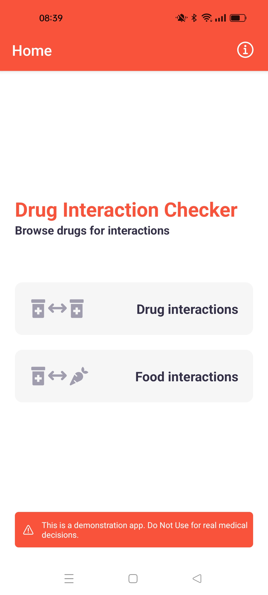
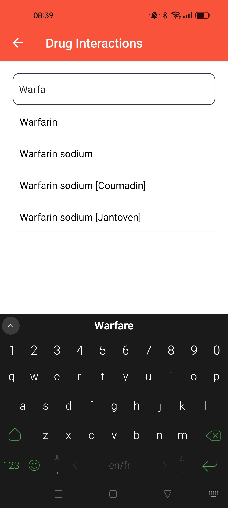
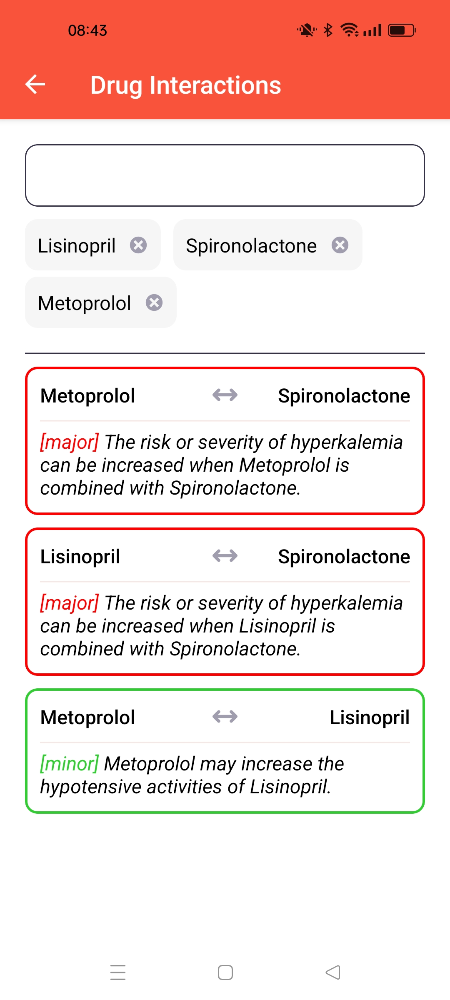
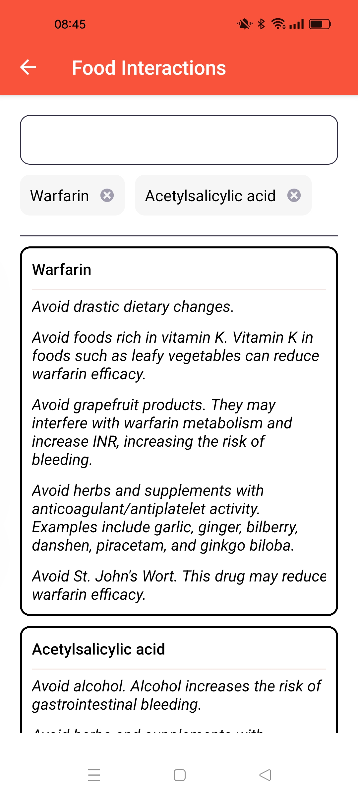
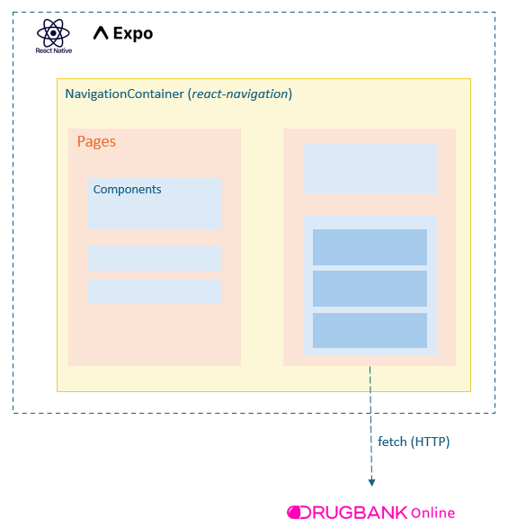

## About Drug Interaction Checker

Hello! This project was created to showcase my skill in building mobile applications using React Native.

The primary purpose of this application is to render more accessible information about drug interactions and incompatibilities. Its goal is to help prevent unintended side effects or reduced effectiveness when taking multiple medications.

This app uses data uses [DrugBank Online](https://go.drugbank.com/)'s API for drug interaction information.

> [!WARNING]
> This is a demonstration app. Do Not Use for real medical decisions.

## Features and Screenshots

- Search drugs database and select drugs
- Display drug-drug interactions, including description and severity
- Display drug-food interactions

  
  
  
  

## Project architecture

  

