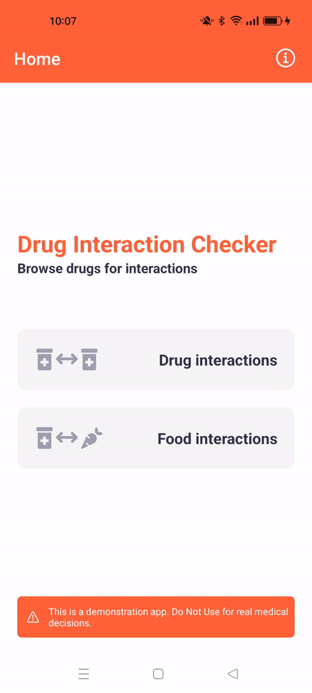

## About Drug Interaction Checker

Hello! This project was created to showcase my skill in building mobile applications using React Native.

The primary purpose of this application is to render more accessible information about drug interactions and incompatibilities. Its goal is to help prevent unintended side effects or reduced effectiveness when taking multiple medications.

This app uses data uses [DrugBank Online](https://go.drugbank.com/)'s API for drug interaction information.

> [!WARNING]
> This is a demonstration app. Do Not Use for real medical decisions.

## Features and Screenshots

- Search drugs database and select drugs
- Display drug-drug interactions, including description and severity
- Display drug-food interactions

<div style="display: flex; flex-direction: row; justify-content: center; margin-bottom: 20px;">
  
</div>

<div style="display: flex; flex-direction: row;">
  
  
  
  
</div>

## Project structure

<div style="display: flex; flex-direction: row; justify-content: center">
  
</div>

## How to test

- https://expo.dev/artifacts/eas/s9AbJPu3rYzPkaCsy7mwHu.apk
-

## License 🔖

```
MIT License

Copyright (c) 2024 Habib El Hourani

Permission is hereby granted, free of charge, to any person obtaining a copy
of this software and associated documentation files (the "Software"), to deal
in the Software without restriction, including without limitation the rights
to use, copy, modify, merge, publish, distribute, sublicense, and/or sell
copies of the Software, and to permit persons to whom the Software is
furnished to do so, subject to the following conditions:

The above copyright notice and this permission notice shall be included in all
copies or substantial portions of the Software.

THE SOFTWARE IS PROVIDED "AS IS", WITHOUT WARRANTY OF ANY KIND, EXPRESS OR
IMPLIED, INCLUDING BUT NOT LIMITED TO THE WARRANTIES OF MERCHANTABILITY,
FITNESS FOR A PARTICULAR PURPOSE AND NONINFRINGEMENT. IN NO EVENT SHALL THE
AUTHORS OR COPYRIGHT HOLDERS BE LIABLE FOR ANY CLAIM, DAMAGES OR OTHER
LIABILITY, WHETHER IN AN ACTION OF CONTRACT, TORT OR OTHERWISE, ARISING FROM,
OUT OF OR IN CONNECTION WITH THE SOFTWARE OR THE USE OR OTHER DEALINGS IN THE
SOFTWARE.
```
